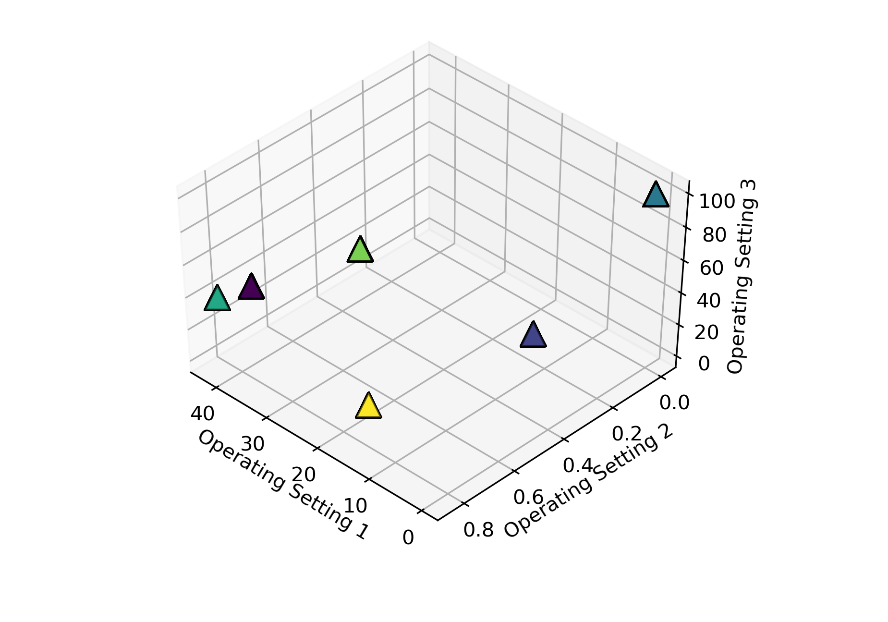
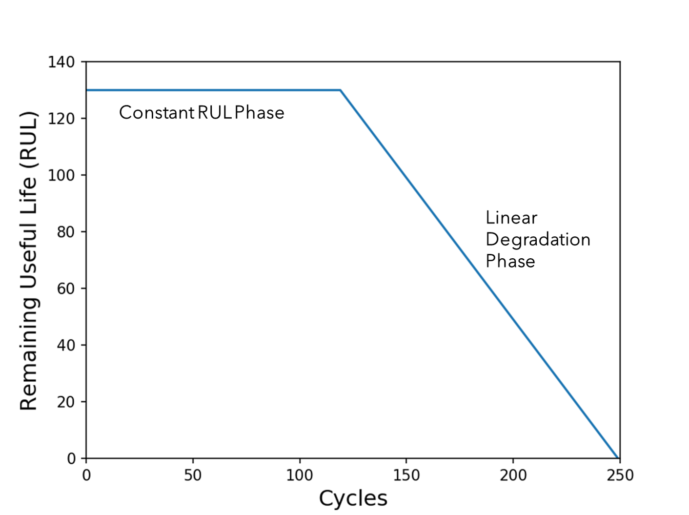
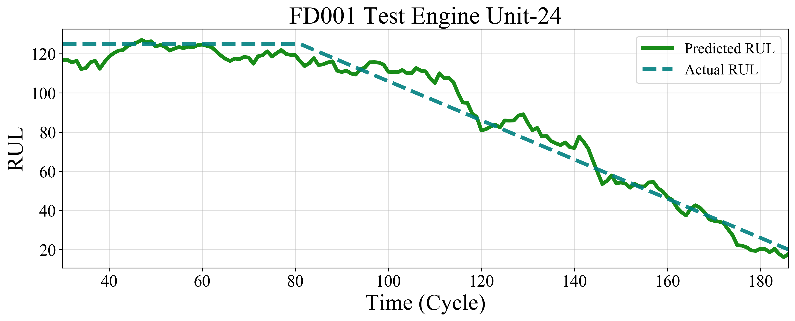
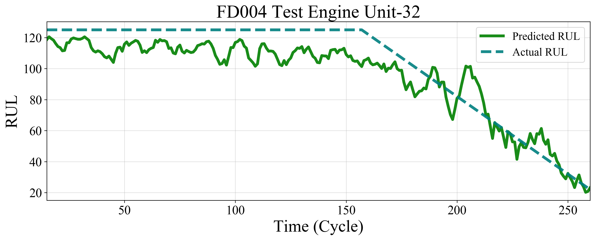

# Remaining Useful Life (RUL) Prediction for Turbofan Engines

 > RUL Prediction for Turbofan Engines (CMPASS dataset) using Convolutional Neural Networks (CNNs)

## Table of Contents

- [Description](#description)
- [How To Use](#how-to-use)
- [Results](#results)
- [References](#references)

------------------
## Description

The application of machine learning in the field of predictive maintenance is increasing significantly. Because of the wide range of sensors used in chemical and manufacturing plants, there is a huge amount of data available. This sensor data can be utilized to observe and predict machine health conditions. Two dominant application areas for machine learning are Fault Diagnosis and Identification (FDI) and Remaining Useful Life (RUL) estimation. This repository presents a CNN bases model for the RUL estimation of the Turbofan Engine.

*"The process of Remaining Useful Life (RUL) estimation of system/subsystem/component that is degrading due to either normal operation (no fault symptoms) or detected the fault."*

### Turbofan Engine (CMAPSS) Dataset
One of the most discussed data sets in the prognostics literature is NASA’s C-MAPSS data set. The C-MAPSS data set includes 4 sub-datasets namely FD001, FD002, FD003, FD004. Each sub data set is further divided into train and test data set. The data sets are arranged in an N x 26 matrix where N corresponds to the number of sensor signals recorded for each engine. The table below gives a general overview of the dataset:

Dataset | FD001 | FD002 | FD003 | FD004 
------- | -----| ------| ------| -----
Engine Trajectories for Training| 100 | 260 | 100 | 249
Engine Trajectories for Testing | 100 | 259 | 100 | 248
Operating Conditions | 1 | 6 | 1 | 6
Fault Modes | 1 | 1 | 2 | 2

 The dataset and realted litrature can be downloaded from [here](https://ti.arc.nasa.gov/tech/dash/groups/pcoe/prognostic-data-repository/)

#### Identifying Operating Regime
The FD002 and FD004 sub-dataset has 6 operating conditions, which can be determined by operating setting columns. However, the range of operating settings is not specified in the data set. So, 6 different operating regimes can be identified by clustering as shown in the figure. While doing normalization of FD002 and F004 data, it is advisable to do it operating regime wise. 

Please refer **CMPASS_Clustering** file for further details and code.

#### RUL Target Function
The target function is modeled as a piece-wise function. In the literature, it has been discussed that the degradation of an engine is not noticeable until after the unit has been operated for some period of time and the initial failure had developed. So the RUL for each trajectory in the dataset can be limit reasonably within the range of 120 to 130 cycles.

### CNN
In this work, CNN-2D has been used. The inputs are prepared in the shape of 2D feature map Ntw x Nft where Ntw is the temporal dimension and Nft is the feature dimension. The convolution operating is performed only in the temporal dimension. Total 5-CNN layers have been used. The size of output feature maps is constant throughout the architecture.

---------
## How to Use
Inside the **CODE_FILES** folder, there are multiple files. Putting all the files in the same location and running **CMPASS_RUNFILE** will execute the code successfully. All the necessary inputs have to be specified in the same file. 

- **CMPASS_Clustering** file performs clustering by operating settings. It also calculated the history of operating conditions and adds extra columns to the data set. These columns can be used as input features.
- **CMAPSS_Dataloader** prepares the data loader. This includes data pre-processing, label generation, and sequence length generation.
- **CMAPSS_CNN** has the CNN architecture.
- **CMAPSS_TrainLoop** performs training, validation, and testing.
- **CMAPSS_PlotFunctions** generated the necessary plots and calculates final score.

------------
## Results
Some of the results plots from the test data set has been shown here for reference.

 
----------------
## References
1.  Utkarsh Panara *Time Series Analysis for Remaining Useful Life Estimation in Prognostics using Generalized Dilation Convolutional Neural Networks* - Master Thesis 

2. S. B. Giduthuri, Z. Peilin, and L. Xiao-Li. *Deep Convolutional Neural Network Based Regression Approach for Estimation of Remaining Useful Life* 2016. doi: 10.1007/978- 3-319-32025-0{\textunderscore}14

3. X. Li, Q. Ding, and J.-Q. Sun. *Remaining useful life estimation in prognostics using deep convolution neural networks* In: Reliability Engineering & System Safety 172 (2018), pp. 1–11. issn: 09518320. doi: 10.1016/j.ress.2017.11.021.

[Back To The Top](#remaining-useful-life-(RUL)-prediction-for-turbofan-engines)